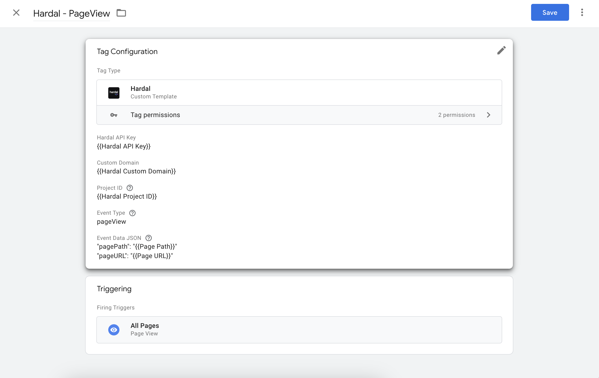

<p align="center">
  <a href="https://usehardal.com/?utm_source=github&utm_medium=gatsby_plugin_logo" target="_blank">
    
  </a>
</p>

# Hardal Google Tag Manager Template

[](https://www.gnu.org/licenses/gpl-3.0) [](https://semver.org)

An official template to using [Hardal](https://usehardal.com/) for Google Tag Manager (GTM) that allows you to track events by sending server-side events to a specified API endpoint. The template provides options to customize the API key, custom domain, and event data.

## Usage

To use this GTM template, follow these steps:

1. Download the template file (`Hardal.tpl`).
2. Import the template files into your Google Tag Manager workspace.
3. Create a new Tag in GTM and choose the trigger which you want.
4. Configure the tag with the necessary parameters:

   - `projectId`: Replace this with your desired project ID.
   - `apiKey`: Replace this with your API key provided by the API service you are using.
   - `eventType`: The type of event you want to track.
   - `eventvalue`: The value associated with the event.
   - `eventData`: An object containing additional event data.

   You can also provide a `customDomain` parameter if you want to use a specific domain for the API endpoint. If not provided, it will default to 'beta.usehardal.com'.

5. Add trigger(s) to the tag to determine when the pixel should be sent.

6. Save and publish your changes in GTM.

## Example Usage

Here's an example of how the tag configuration might look like:




## Example Data

Here's an example of how your data convert through server-side endpoint response:

```json
{
  "projectId": "12345",
  "apiKey": "YOUR_API_KEY_HERE",
  "eventType": "purchase",
  "eventvalue": "99.99",
  "eventData": {
    "product": "Example Product",
    "quantity": 1,
    "currency": "USD",
    ...and/or your any parameters 
  },
  "customDomain": "ss.example.com"
}
