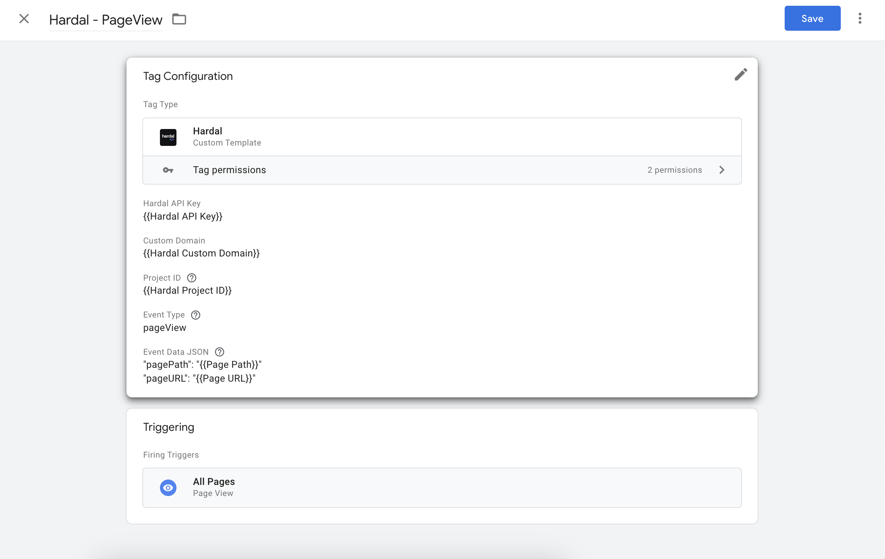

<p align="center">
  <a href="https://usehardal.com/">
    <picture>
      <source media="(prefers-color-scheme: dark)" srcset="https://imge.usehardal.com/cdn/logo/new/svg/hnav0hronsb1fttdnmph.svg?raw=1">
      <source media="(prefers-color-scheme: light)" srcset="https://imge.usehardal.com/cdn/logo/new/svg/ptlior6hfvknmblekenh.svg?raw=1">
      
    </picture>
  </a>
</p>

# Hardal Event Tag for Google Tag Manager

Send named website events to Hardal's `/api/ss-collect` endpoint from a Google Tag Manager (GTM) **web container**. This tag sends a browser pixel request with a project ID, API key, event name, value, and additional properties.

[](https://www.gnu.org/licenses/gpl-3.0) [](Hardal.tpl)

## Getting started

You need a GTM web container, a Hardal project ID and API key, and the collection domain for your integration. Configuration values are included in browser requests.

## Installation and configuration

1. Download [Hardal.tpl](Hardal.tpl).
2. In the GTM web container, open **Templates > Tag Templates > New** and import the file.
3. Create a tag using the imported Hardal template.
4. Configure the tag with the necessary parameters:

   - `projectId`: Replace this with your desired project ID.
   - `apiKey`: Your Hardal API key.
   - `eventType`: The type of event you want to track.
   - `eventvalue`: The value associated with the event.
   - `eventData`: JSON properties as text, without surrounding braces; see the example below.

   You can also provide a `customDomain` parameter if you want to use a specific domain for the API endpoint. If not provided, the template defaults to `beta.usehardal.com`.

5. Add a trigger to determine when the event should be sent, then check the request in GTM Preview.

6. Save and publish your changes in GTM.

## Example configuration

Here's an example of how the tag configuration might look like:



## Example event data

The `eventData` field is text; enter the JSON properties without surrounding braces. This matches the template's request format.

```json
{
  "projectId": "12345",
  "apiKey": "YOUR_API_KEY_HERE",
  "eventType": "purchase",
  "eventvalue": "99.99",
  "eventData": "\"product\":\"Example Product\",\"quantity\":1,\"currency\":\"USD\"",
  "customDomain": "ss.example.com"
}
```

## Support

Maintained by [Hardal](https://github.com/usehardal).

- [Hardal documentation](https://docs.usehardal.com)
- [Report an issue](https://github.com/usehardal/hardal-google-tag-manager-template/issues)
- [Hardal website](https://usehardal.com)

